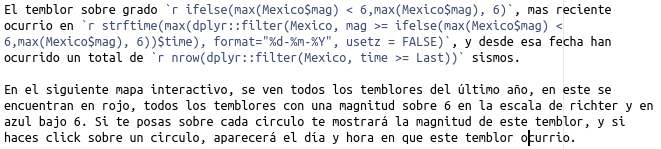

```{r setup, include=FALSE}
knitr::opts_chunk$set(echo = TRUE, warning = FALSE, message = FALSE, cache = FALSE, tidy = TRUE, tidy.opts = list(width.cutoff = 50))
library(tidyverse)
library(broom)
library(kableExtra)
library(crosstalk)
library(leaflet)
library(DT)
library(plotly)
library(downloadthis)
options("kableExtra.html.bsTable" = T)
```

# Introduction

## What is reproducible research?

* Interlaced code, data (**Raw**) and text
* Repos on github
* in R: Rmarkdown (Rmd)

```{r, echo = FALSE, out.width = "1000px"}
knitr::include_graphics("Reproducible.png")
```

## Reproducibility en R

```{r, echo = F, out.width='30%', fig.align='center'}
knitr::include_graphics("Rmark.png")
```

1. A folder
     + Raw data (csv, xls, html, json)
     + Code and text (Rmd, shiny)
     + Results (Manuscript, Web Page, App)
     

## Some motivation

* The [webpage of a project](https://danish-flora-and-vegetation.github.io/)
* interactive [plots and documents](https://danish-flora-and-vegetation.github.io/MapAndnmds/map.html). 
* Presentations with [interactive elements](https://rpubs.com/derek_corcoran/MolsRewild)
* Full manuscripts

## External Resources

* Rmarkdown the [ultimate guide](https://bookdown.org/yihui/rmarkdown/)
* [Cheat sheet](https://www.rstudio.com/wp-content/uploads/2015/02/rmarkdown-cheatsheet.pdf)

# Objectives

## Objectives

* **Part 1:** Set up the project and rmarkdown basics
* **Part 2:** getting the most of your rmd by using interactive HTML
* **Part 3:** Reusing code for presentations and PDfs

# Part 1 Set up the project and rmarkdown basics

## In this part

* Start a new project
* Generate your github repo
* Generate your readme file
* Simple html report

## Start a new project and generate your github repo

```{r usethis, eval = FALSE}
usethis::use_git()
# set your credentials if you must
gitcreds::gitcreds_set()
# if you dont have a pat you can use
usethis::create_github_token()
# if you need add your PAT
usethis::edit_r_environ()
# generate your readme
usethis::use_readme_rmd()
# Edit and upload to git
usethis::use_github()
```

## lets get the dataset

```{r, echo = F}
Species <- readr::read_csv("Species.csv")

Species %>%
  download_this(
    output_name = "Species_dataset",
    output_extension = ".csv",
    button_label = "Download data as csv",
    button_type = "default",
    has_icon = TRUE,
    icon = "fa fa-save"
  )
```

Variables:

* **lon**: Longitude in decimal degrees
* **Lat**: Latitude in decimal degrees
* **bio_1** to bio_19 bioclimatic variables as defined in [worldclim](https://www.worldclim.org/data/bioclim.html)
* **abund_sp1** to abund_sp4: abundance of species 1, 2 and 4


## Basic rmarkdown

  1. Text
  2. Chunks
  3. Inline code
  4. [Cheat sheet Rmd](https://www.rstudio.com/wp-content/uploads/2015/02/rmarkdown-cheatsheet.pdf)
  5. The magic button **Knit**
  

```{r, echo = FALSE}
knitr::include_graphics("RMDexample.png")
```


## Text

[link](https://stackoverflow.com/users/3808018/derek-corcoran)

```{r, echo = TRUE, eval=FALSE}
# Title

## subtitle

*cursive*

**bold**

[link](https://stackoverflow.com/users/3808018/derek-corcoran)
```


## Chunks

```{r, echo = F}
knitr::include_graphics("Chunk.png")
```

+ *echo* = T o F show code
+ *message* = T o F shows message of packages
+ *warning* = T o F shows or does not show warning 
+ *eval* = T o F runs or does not run the code
+ *cache* = T o F saves the result or not
+ For more options check this [link](https://yihui.name/knitr/options/)

## Inline code



- Code interlinked with text
- To update means, maximum, minimum
- p-values, statistical differences
- They can be vectors, and not tables.

## State the objective of the project in your readme

* include a chunk
* include an inline code
* include a graph
* try to include a table

```{r, echo = F}
library(countdown)
countdown(minutes = 5, seconds = 0)
```

## First look at the dataset

```{r, echo = F}
binpal1 <- colorNumeric("viridis", sort(unique(Species$abund_sp1)))
binpal2 <- colorNumeric("viridis", sort(unique(Species$abund_sp2)))
binpal4 <- colorNumeric("viridis", sort(unique(Species$abund_sp4)))

leaflet(data = Species) %>%
  addTiles() %>% 
  leaflet::addCircles(lng = ~lon, lat = ~lat, group = "Species 1", color = ~binpal1(abund_sp1), popup = ~paste("Abundance Species 1:", prettyNum(abund_sp1, big.mark = ",")), label = ~paste("Abundance Species 1:", prettyNum(abund_sp1, big.mark = ","))) %>%
    leaflet::addCircles(lng = ~lon, lat = ~lat, group = "Species 2", color = ~binpal2(abund_sp2), popup = ~paste("Abundance Species 2:", prettyNum(abund_sp2, big.mark = ",")), label = ~paste("Abundance Species 2:", prettyNum(abund_sp2, big.mark = ","))) %>%
    leaflet::addCircles(lng = ~lon, lat = ~lat, group = "Species 4", color = ~binpal4(abund_sp4), popup = ~paste("Abundance Species 4:", prettyNum(abund_sp4, big.mark = ",")), label = ~paste("Abundance Species 4:", prettyNum(abund_sp4, big.mark = ","))) %>% addLegend("bottomright", pal = binpal1, values = ~abund_sp1,
    title = "Abundance spp1",
    labFormat = labelFormat(big.mark =","),
    opacity = 1,
    group = "Species 1"
  ) %>%
  addLegend("bottomright", pal = binpal2, values = ~abund_sp2,
    title = "Abundance spp2",
    labFormat = labelFormat(big.mark =","),
    opacity = 1,
    group = "Species 2"
  ) %>%
  addLegend("bottomright", pal = binpal4, values = ~abund_sp4,
    title = "Abundance spp4",
    labFormat = labelFormat(big.mark =","),
    opacity = 1,
    group = "Species 4"
  )  %>% 
   addLayersControl(
    overlayGroups = c("Species 1", "Species 2", "Species 4"),
    options = layersControlOptions(collapsed = T)
  ) %>% 
  hideGroup("Species 2") %>% 
  hideGroup("Species 4")
```

## First look at the dataset (cont.)

```{r, echo = F}
Species2 <- Species %>% 
  pivot_longer(cols = abund_sp1:abund_sp4, names_to = "Species", values_to = "Abundance") %>% mutate(Species = str_remove_all(Species, "abund_"), Species =str_replace_all(Species, "sp", "Spp "))

G1 <- ggplot(Species2, aes(x = bio_1, y = Abundance)) + geom_point() + geom_smooth() + facet_wrap(~Species, scales = "free_y") + theme_bw()

ggplotly(G1)
```

# First html report

## More advanced rmarkdown

Get the template in this [link](https://raw.githubusercontent.com/derek-corcoran-barrios/OikosRepoducibleResearch/master/01-FirstHtml/Template1.Rmd)

* Includes the use of references
* Crossrefences of tables, figures, equations, etc
* More in the [bookdown package gitbook](https://bookdown.org/yihui/bookdown/)
* Includes example of the [kableExtra package](https://cran.r-project.org/web/packages/kableExtra/vignettes/awesome_table_in_html.html)

## Second activity

* Document in your readme the creation of this document and it's objective
* Generate graphs and tables for your project and make crossreferences
* Change the style of your bibliography using [csl](https://www.zotero.org/styles)
* Until 10 am

# Part 2: getting the most of your rmd by using interactive HTML

## In this part

* Generate interactive tables with *DT*
* Generate interactive plots with *plotly*
* Generate interactive maps with *leaflet*
* Let them comunicate through *crosstalk*

## The basics of DT

At its most basic you just need to do:

```{r, echo = T}
DT::datatable(Species)
```

## Add some extra

```{r, echo = F}
DT::datatable(Species, extensions = c('Buttons', 'ColReorder'),
          caption = 'Species abundances and explaining variables.',
            filter = "top",
            options = list(dom = 'Blfrtip',
                            colReorder = TRUE,
                          scrollX='400px',
                           scrollY='200px',
                           buttons = c('copy', 'csv', 'excel', I('colvis')),
                           lengthMenu = list(c(10,25,50,-1),
                                             c(10,25,50,"All")))) %>%
    formatRound(columns=c("lon", "lat", "bio_1", "bio_2", "bio_3", "bio_4", "bio_5", 
"bio_6", "bio_7", "bio_8", "bio_9", "bio_10", "bio_11", "bio_12", 
"bio_13", "bio_14", "bio_15", "bio_16", "bio_17", "bio_18", "bio_19", 
"abund_sp1", "abund_sp2", "abund_sp4"), digits=3)
```

## Lets check the code

```{r, echo = T, eval = F}
# Extensions to reorder columns and to add buttons
Test <- DT::datatable(Species, extensions = c('Buttons', 'ColReorder'),
          caption = 'Species abundances and explaining variables.',
          ## You can filter the data on top
            filter = "top",
          ## https://datatables.net/reference/option/dom
            options = list(dom = 'Blfrtip',
          ## you can reorder columns
                            colReorder = TRUE,
          ## You can scroll de table
                          scrollX='400px',
                           scrollY='200px',
          ## you can download or take away variables
                           buttons = c('copy', 'csv', 'excel', I('colvis')),
          ### how long you can make tables
                           lengthMenu = list(c(10,25,50,-1),
                                             c(10,25,50,"All"))))
```

## Continued

```{r, echo = T, eval=FALSE}

# round the digits of these columns
Test  %>%   formatRound(columns=c("lon", "lat", "bio_1", "bio_2", "bio_3", "bio_4", "bio_5", 
"bio_6", "bio_7", "bio_8", "bio_9", "bio_10", "bio_11", "bio_12", 
"bio_13", "bio_14", "bio_15", "bio_16", "bio_17", "bio_18", "bio_19", 
"abund_sp1", "abund_sp2", "abund_sp4"), digits=3)
```

* For more examples [check DT](https://rstudio.github.io/DT/)

## The basics of plotly

* if you know how to use ggplot, you can use plotly

```{r, echo = T}
Species2 <- Species %>% 
  pivot_longer(cols = abund_sp1:abund_sp4, names_to = "Species", values_to = "Abundance") %>% mutate(Species = str_remove_all(Species, "abund_"), Species =str_replace_all(Species, "sp", "Spp "))
```

## ggplotly

```{r, echo = T, eval = F}
G <- ggplot(Species2, aes(x = bio_12, y = Abundance)) + 
  geom_point(aes(color = Species)) +
  geom_smooth(aes(color = Species)) + 
  theme_bw()

ggplotly(G)
```

## The graph

```{r, echo = F}
G <- ggplot(Species2, aes(x = bio_12, y = Abundance)) + 
  geom_point(aes(color = Species)) +
  geom_smooth(aes(color = Species)) + 
  theme_bw()

ggplotly(G)
```

## More control with plotly

* View [plotly website](https://plotly.com/r/)

```{r, echo = F}
## Create a function
create_buttons <- function(df, x_axis_var_names) {
  lapply(
    x_axis_var_names,
    FUN = function(var_name, df) {
      button <- list(
        method = 'restyle',
        args = list('x', list(df[, var_name])),
        label = sprintf('x axis %s', var_name)
      )
    },
    df
  )
  
}

y_axis_var_names <- c("bio_1", "bio_2", "bio_3", "bio_4", "bio_5", "bio_6",
                      "bio_7", "bio_8", "bio_9", "bio_10", "bio_11", "bio_12", "bio_13",
                      "bio_14", "bio_15", "bio_16", "bio_17", "bio_18", "bio_19")

p <- plot_ly(Species, x = ~bio_1, y = ~abund_sp4, mode = "markers", name = "A", visible = T) %>%
  layout(
    yaxis = list(title = "Abundance"),
    xaxis = list(title = "x variable"),
    updatemenus = list(
      list(
        y = 0.7,
        buttons = create_buttons(Species, y_axis_var_names)
      )
    ))
p
```

## Basics of leaflet

* Get more at the [leaflet webpage](https://rstudio.github.io/leaflet/)

```{r}
leaflet(data = Species) %>% 
  addTiles() %>% 
  addCircles(lng = ~lon, lat =~lat)
```


## Basics of crosswalk

* you need to add a dataframe or data frame like object into a shared data:

```{r, echo = T}
sd <- SharedData$new(Species2)
```


## Generate filters

```{r, echo = T, eval = FALSE}
crosstalk::filter_checkbox("Species", "Species", sd, ~Species)
crosstalk::filter_slider("Abundance", "Abundance", sd, ~Abundance, step = 10, round = T, min = min(Species2$Abundance), max = max(Species2$Abundance))

```

* More on the [crosstalk webpage](https://rstudio.github.io/crosstalk/index.html)

## Activity 3

Check the template in this [link](https://raw.githubusercontent.com/derek-corcoran-barrios/OikosRepoducibleResearch/master/02-Interactive_document/TemplateInteractive.Rmd) and:

* Add to your report with interactive widgets and if you feel that it helps with your crosswalk.
* Try with the prior exploration, and variables you feel are important, to allow the user (advisor, colleague, co-author, etc.), To help you explore the relationships.
* When you are ready lets publish to [rpubs](https://rpubs.com/)
* Dont forget to push to github
